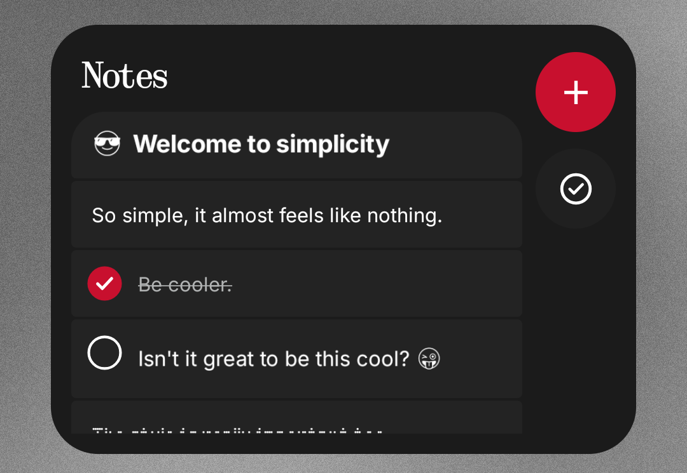

<div align="center">

# Nothing Notes

### *So simple, it almost feels like Nothing.*

[](#-descarga)
[](#-descarga)
[](#-diseño)

</div>

---

## About Nothing Notes

**Nothing Notes** is focused in fill the absence of a native notes apps in the Nothing OS ecosystem.

The interface is inspired by different aspects across the native apps of Nothing OS such as Gallery, Nothing X, Recorder and Weather.

---

## Screenshots

<div align="center">
  
  &nbsp;&nbsp;
  
  &nbsp;&nbsp;
  
</div>

<br>

<div align="center">
  
  &nbsp;&nbsp;
  
  
</div>


---

## Features

- **Quick and simple notes** — Straight forward interface to make the important thing: take notes
- **Pinned notes** — There are just some ideas that are more important.
- **Folders** — Organize your thoughts by subjects, we dont want it all mixed up do we?.
- **Progress checklist** — Have a long checkbox in your note? Activate this feature to see the progress.
- **Quick search** — Find your thoughts quickly.
- **Delete by gesture** — You can delete a note just by sliding to the left, just like in the Recorder app.
- **Recently deleted** — Made a mistake deleting something? You can recover it.
- **Emojis** — Noto emojis keep the minimalist and simplicity in the app.
- **Share** — Need to share ideas? Copy a plain text of your note and send it somewhere.
- **Date and hour** — Every note saves the last time it was modified.
- **Widgets** — Access your notes from your homescreen, quick and simple.
---


## A simple workflow

```text
Write.
Organize.
Check.
Done.
```
---

## 📦 Download

The recomended way to install Notes is to download the apk from **Releases** section of the repository.

1. Open **Releases**.
2. Choose the most recent version.
3. Download the `.apk` files from **Assets**.
4. Install it in your Android.

> [!NOTE]
> Android might require permission to install apps from external sources manually. We don't ask ANY kind of access to your phone. 

---

## Roadmap (MAYBE)

- [ ] Draw feature
- [ ] Images & photos
- [ ] Voice notes
- [ ] Cloud back up with Google
- [ ] Shared notes widget
---

## ⚠️ Disclaimer

**Nothing Notes is an independent project.** It's not affiliated nor sponsored by **Nothing Technology Limited**. 

---

<div align="center">

So simple, it almost feels like Nothing.
**Nothing Notes** · Android

</div>
