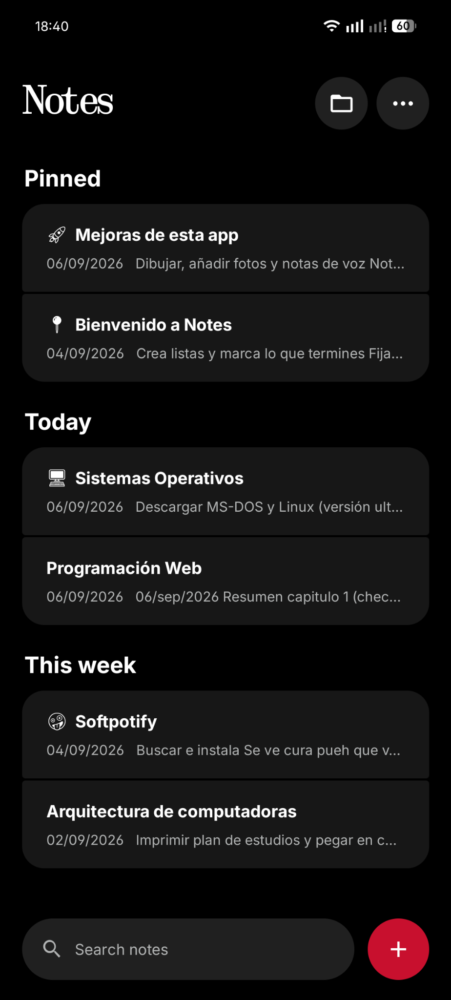
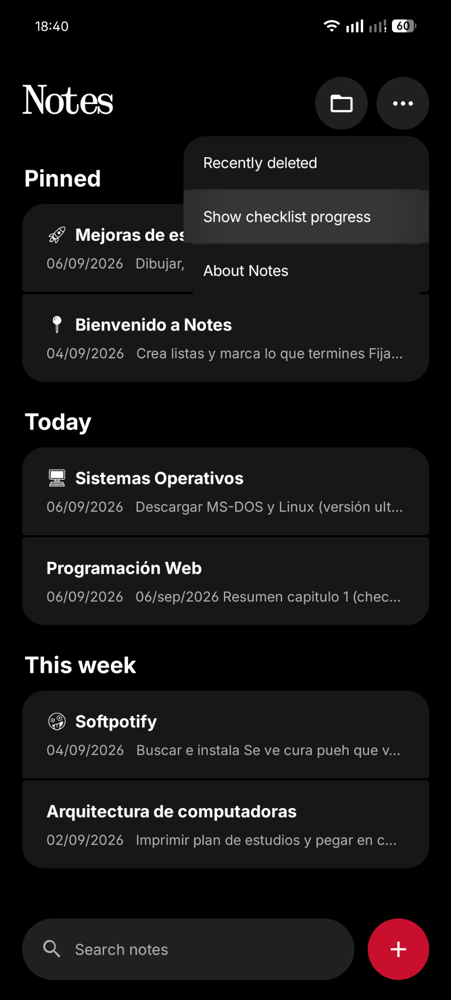
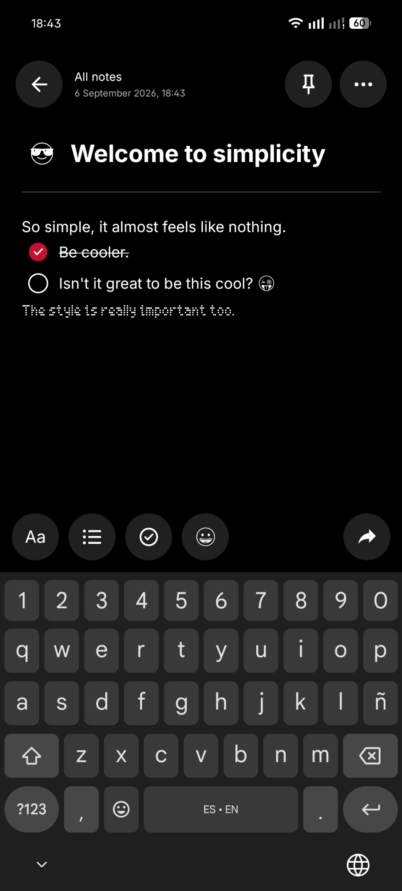
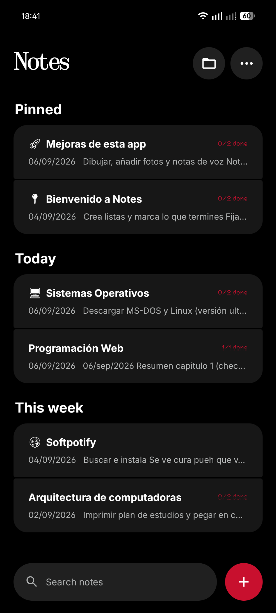
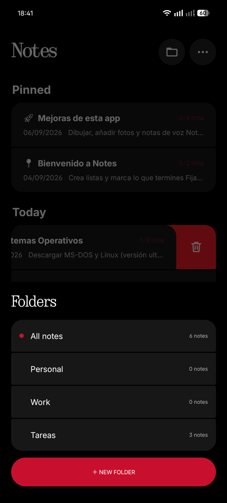

<div align="center">

# ⬛ Nothing Notes

### *So simple, it almost feels like Nothing.*

Una app de notas para Android con una experiencia **minimalista, rápida y visualmente inspirada en Nothing OS**.

[](#-descarga)
[](#-descarga)
[](#-diseño)

</div>

---

## ✨ Sobre Nothing Notes

**Nothing Notes** busca hacer una sola cosa y hacerla bien: permitirte escribir, organizar y encontrar tus notas sin llenar la pantalla de elementos innecesarios.

Su interfaz combina un fondo negro profundo, tarjetas oscuras, tipografía limpia, acentos rojos y pequeños detalles visuales que recuerdan al lenguaje de diseño de **Nothing OS**.

> Minimalismo primero. Tus notas después. Nada más.

---

## 📱 Capturas

<div align="center">
  
  &nbsp;&nbsp;
  
  &nbsp;&nbsp;
  
</div>

<br>

<div align="center">
  
  &nbsp;&nbsp;
  
</div>

---

## 🔥 Características

- 📝 **Notas rápidas y limpias** — crea y edita notas con una interfaz enfocada en el contenido.
- 📌 **Notas fijadas** — mantén lo importante siempre en la parte superior.
- 📂 **Carpetas** — organiza tus notas por categorías como Personal, Work o Tareas.
- ✅ **Checklists** — convierte tus notas en listas de tareas y marca elementos completados.
- 📊 **Progreso de checklist** — muestra el avance de tus tareas directamente desde la lista de notas.
- 🔎 **Búsqueda rápida** — encuentra notas sin navegar carpeta por carpeta.
- 🗑️ **Eliminación por gesto** — desliza una nota para acceder rápidamente a la acción de eliminar.
- ♻️ **Recently deleted** — acceso a notas eliminadas recientemente.
- 😀 **Emojis** — agrega personalidad y referencias visuales a tus notas.
- 📤 **Compartir** — comparte el contenido de una nota desde el editor.
- 📅 **Fecha y hora** — cada nota conserva información temporal visible.
- 🌑 **Diseño oscuro** — pensado alrededor de una experiencia predominantemente negra y de alto contraste.

---

## ⚫ Diseño

Nothing Notes toma inspiración visual de **Nothing OS**, especialmente en:

- fondos negros y superficies oscuras;
- composición espaciosa y minimalista;
- tarjetas con bordes ampliamente redondeados;
- acentos rojos para acciones y estados importantes;
- iconografía simple y de alto contraste;
- detalles tipográficos y elementos de estilo *dot-matrix*;
- una interfaz con muy poco ruido visual.

El objetivo no es copiar Nothing OS, sino trasladar esa filosofía de **simplicidad, personalidad y funcionalidad** a una aplicación de notas.

---

## 🧠 Una experiencia sencilla

```text
Write.
Organize.
Check.
Done.
```

Nothing Notes evita menús innecesariamente complejos y mantiene las acciones principales a pocos toques de distancia.

### Pantalla principal

Las notas se agrupan de forma natural en secciones como **Pinned**, **Today** y **This week**, permitiendo reconocer rápidamente qué es importante y qué has estado usando recientemente.

### Editor

El editor incluye accesos directos para trabajar con texto, listas, checklists, emojis y compartir contenido, sin perder el enfoque minimalista de la aplicación.

### Carpetas

La vista de carpetas permite separar diferentes áreas de tu vida y consultar cuántas notas contiene cada sección.

---

## 📦 Descarga

La forma recomendada de instalar Nothing Notes es descargar el APK desde la sección **Releases** de este repositorio.

1. Abre **Releases**.
2. Entra en la versión más reciente.
3. Descarga el archivo `.apk` desde **Assets**.
4. Instálalo en tu dispositivo Android.

> [!NOTE]
> Android puede solicitar permiso para instalar aplicaciones desde fuentes externas al instalar un APK manualmente.

---

## 🚀 Roadmap

Algunas ideas para futuras versiones:

- [ ] Dibujos dentro de las notas
- [ ] Imágenes y fotografías
- [ ] Notas de voz
- [ ] Más opciones de personalización
- [ ] Mejoras en organización y búsqueda

---

## ❤️ Filosofía

> **So simple, it almost feels like nothing.**

Una app de notas no debería distraerte de aquello que intentas recordar.

---

## ⚠️ Disclaimer

**Nothing Notes es un proyecto independiente.** No está afiliado, patrocinado ni respaldado por **Nothing Technology Limited**. Los nombres y marcas mencionados pertenecen a sus respectivos propietarios. La interfaz está únicamente **inspirada en la estética y filosofía visual de Nothing OS**.

---

<div align="center">

Made for people who just want to write.

**Nothing Notes** · Android

</div>
